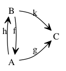
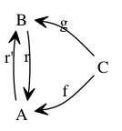
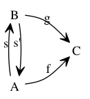
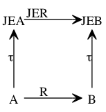
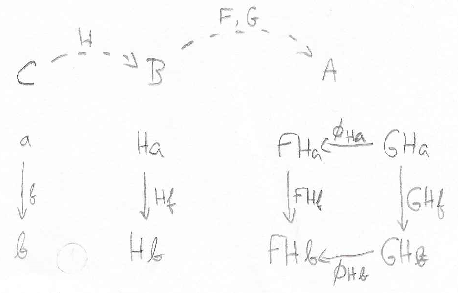
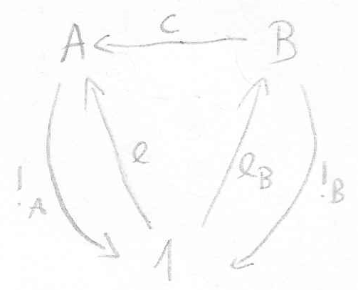
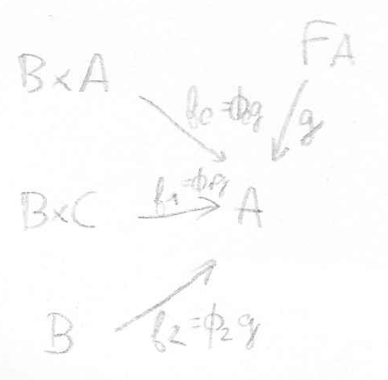
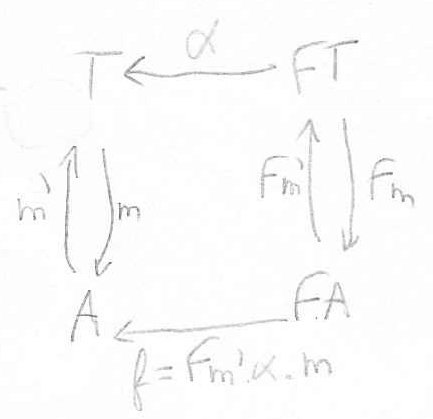
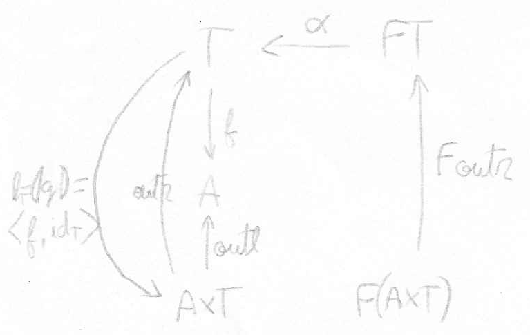

## Solutions

### 2.1 (page 29)

If the function `f` is instantiated as id<sub>A</sub>:

```
  f . u
=   {substitute f}
  idA . u
=   {identity as unit of composition}
  f
```

Per the exercise, `f . u = f` must hold for every `f`. The only possible `u` for `f = idA` is `idA`; therefore, `u = idA`.

### 2.2

The diagram for this exercise is:



`(k . h . f . h): C <- A` is well defined.

`g . k . h` is not well defined, as `g: C <- A` cannot be applied after `(k . h): C <- A`.

### 2.3




```
  f
=   {identity as unit of composition}
  idA . f
=   {definition of a retraction}
  r . r' . f
=   {take g = r' . f}
  r . g.
```

The dual of a retraction is a co-retraction, an arrow `s: B <- A` such that exists an arrow `s': A <- B` such that `s' . s = idA`. The dual property is that if `s: B <- A` is a co-retraction, then for any arrow `f: C <- A` there exists an arrow `g: C <- B` such that `g . s = f`.

### 2.4

Proof that `g` is monic:

```
  g . i = g . j
=>  {application of f}
  f . g . i = f . g . j
=>  {preposition}
  id . i = id . j
=>  {identity as unit of composition}
  i = j.
```

`f` is epic by duality. In the opposite category, `g_op . f_op = id` is given. As epics are dual to monics, if `f_op` is monic, then `f` is epic. The proof that `f_op` is monic is given above; therefore, `f` is epic.

### 2.5

The dual statement is that if `g . f` is monic, then `f` is monic. The proof that this statement is true:

```
  f . i = f . j
=>  {application of g}
  g . f . i = g . f . j
=>  {preposition}
  i = j.
```

By duality, the original statement is also true.

### 2.6

As each object represents a single element of A and by the definition of the arrows, there is at most one arrow between any given pair of objects. Given those conditions, every arrow must be monic and epic.

More formally, let `m: A <- B`, `f: B <- C` and `g: B <- C`. In order for `m` to be monic, `f = g ≡ m . f = m . g`. Given that there is only one arrow from C to B, `f = g` and the equivalence is obsiously true. The proof for epic arrows is identical.

It is not guaranteed that every arrow is an isomorphism. For example, partial orders are antisymmetric preorders, which means every arrow `f: A <- B` with `A != B` is not an isomorphism.

### 2.7

No. Relations are different from functions in the fact that an element in the source set can be associated with more than one element in the target set.

As a counterexample, consider the arrow `e` corresponding to the onto relation {(0, 0), (0, 1)} in the {0, 1} domain. Both the distinct arrows `f` with relation {(0, 0), (0, 1)} and `g` with relation {(1, 0), (1, 1)}, composed with `e`, yield the arrow `f . e = g . e` with relation {(0, 0), (0, 1)}.

The epic arrows in *Rel* are those in which a set of target elements unambiguously define the corresponding source elements. Relations corresponding to surjective functions obey that rule, but there are relations, such as {(0, 0), (1, 0), (1, 1), (2, 1)} on the {0, 1, 2} domain, which are not partial functions and are epic.

### 2.8

[TODO]

### 2.9 (page 33)

Functors preserve composition. Therefore, `i . j = id` implies that `Fi . Fj = Fid` for any functor `F`.

### 2.10

[TODO]

### 2.11

As `H(f, h) g` is defined as a function (`f . g . h`) and it is a bifunctor, this function must be of the form `Fun <- C0 x C1`. Moreover, by the definition of `H(A, B)` as a set of functions from `B` to `A`, the objects from `C0` and `C1` must belong to the same category or must be mappeable in some way.

The types involved in this bifunctor are:

  * `H(A, B): {A <- B}`;
  * `H(f, h): (A2 <- B2) <- (A <- B)`, where `f: A2 <- A` and `h: B2 <- B`.

As `H(f, h) g` is defined as `f . g . h`. In order for this expression to be well defined, `h` must be a `B <- B2` arrow. Therefore, we conclude that C1 = C0^op and `H: Fun <- C x C^op`.

### 2.12

```haskell
tree f (tip a) = tip (f a)
tree f (bin (t, u)) = bin (tree f t, tree f u)
```

### 2.13

[TODO]

### 2.14 (page 36)

The definition of the natural transformation is `swap: (xt) <- (x)`, where:

```
A xt B = { (b, a) | a ∈ A, b ∈ B }
(f xt g) (b, a) = (g b, f a)
```

### 2.15

`τ` maps a set A to a set of sets whose elements are subsets of A (of one element each). The typing condition is therefore met. It is trivial that `τ . f = Pf . τ`, where `Pf` applies `f` to each element of a set as defined in `P`; therefore, `τ` is a natural transformation.

In order to have `Jτ: JE <- id`, we must have `τR = JER . τ`, which is not true. For any `a: A` where there are several `b0, b1, ..., bn: B` such that `aRbi`, `τR a = {{b0}, {b1}, ..., {bn}}`, while `JER . τ = `{{b0, b1, ..., bn}}`.



### 2.16

`cp` is a natural transformation of the form `P listr <- listr P`, as it obeys the equation `cp . listr Pf = P(listr f) . cp`.

### 2.17

`ΦH` has type `FH <- GH`. The corresponding diagram, which shows that `ΦH` is a natural transformation, is:



### 2.18

In order for `head` to be a natural transformation, `head . listr f = f . head` has to be true for every function `f` in `Par`. It is not, as `f` can be defined for the head element of a list but not for tail elements. For example, taking `f x = 1/x`, `head . listr f [2, 0]` is undefined, while `f . head [2, 0] = 1/2`.

### 2.19

[TODO]

### 2.20 (page 38)

Proof that any element `e` is constant:

```
  e . f = e . g
=>  {equation 2.1}
  e . !C = e . !C.
``` 

The element `e = c . eB`, where `eB` is an element of `B`, is an element for which `c = e . !B`:



### 2.21

In `Fun` and in `Rel`, `0` is the only empty object, as a non-empty function must return at least one value and any relation with a non-zero number of elements in the target size can have infinite source element combinations. In `Fun x Fun`, only `({}, {})` is an empty object.

### 2.22

It means that there is an element that is a minimum in the preorder.

### 2.23

Yes. If `0A` and `1A` are the initial and terminal objects of `A` and `0B` and `1B` are the initial and terminal objects of `B`, `(0A, 0B)` and `(1A, 1B)` are the initial and terminal objects of `A x B`.

### 2.24

[TODO]

### 2.25 (page 44)

Yes. According to the definition of the preorder category and to the arrow diagram for products, a product of two natural numbers A and B is a number AxB where AxB >= A and AxB >= B. Therefore, the maximum number is a product of every other two numbers, including itself. As the opposite category of a partial order is also a partial order, the minimum is a co-product of every pair of elements.

### 2.26

```
  unit . unit^-1 = idA
=>  {take unit = outl}
  outl . unit^-1 = idA
=>  {cancellation property}
  unit^-1 = 〈idA, f〉
=>  {uniqueness of !A}
  unit^-1 = 〈idA, !A〉.
```

```
  swap = swap^-1 = idAxB
=>  {take swap = 〈outr, outl〉}
  〈outr, outl〉 . swap^-1 = idAxB
=>  {reflection law}
  〈outr, outl〉 . swap^-1 = 〈outl, outr〉
=>  {take swap^-1 = 〈f, g〉}
  〈outr, outl〉 . 〈f, g〉 = 〈outl, outr〉
=>  {fusion law}
  〈outr . 〈f, g〉, outl . 〈f, g〉〉 = 〈outl, outr〉
=>  {cancellation property}
  〈g, f〉 = 〈outl, outr〉
=>  {take swap^-1 = 〈f, g〉}
  swap^-1 = 〈outr, outl〉.
```

```
  assocr . assocl = id
=>  {take assocr = 〈outl . outl, 〈outr . outl, outr〉〉}
  〈outl . outl, 〈outr . outl, outr〉〉 . assocl = id
=>  {reflection law (twice)}
  〈outl . outl, 〈outr . outl, outr〉〉 . assocl = 〈outl, outr〉
=>  {take assocl = 〈f, g〉}
  〈outl . outl, 〈outr . outl, outr〉〉 . 〈f, g〉 = 〈outl, outr〉
=>  {fusion law}
  〈outl . outl . 〈f, g〉, 〈outr . outl, outr〉 . 〈f, g〉〉 = 〈outl, outr〉
=>  {fusion law}
  〈outl . outl . 〈f, g〉, 〈outr . outl . 〈f, g〉, outr . 〈f, g〉〉〉 = 〈outl, outr〉
=>  {cancellation property}
  〈outl . f, 〈outr . f, g〉〉 = 〈outl, outr〉
=>  {take assocl = 〈f, g〉, cancellation property}
  assocl = 〈〈outl, outl . outr〉, outr . outr〉.
```

### 2.27

```
  〈[f, g], [h, k]〉 = [〈f, h〉, 〈g, k〉]
≡   {universal property of product}
  outl . [〈f, h〉, 〈g, k〉] = [f, g] ∧ outr . [〈f, h〉, 〈g, k〉] = [h, k]
≡   {co-product fusion law}
  [outl . 〈f, h〉, outl . 〈g, k〉] = [f, g] ∧ [outr . 〈f, h〉, outr . 〈g, k〉] = [h, k]
≡   {product cancellation property}
  [f, g] = [f, g] ∧ [h, k] = [h, k].
```

### 2.28

The projections are not monic in `Fun`; in particular, for any source object `A x 0`, `f . outl = g . outl` for any `f` and `g`, as `A x 0` has size 0 (a symmetric explanation applies for `outr`). Injections are indeed monic. Duality would only be contradicted if the conditions above applied to every category.

### 2.29

[TODO]

### 2.30

```
  outl . 〈f, g〉 a = f a   if undefined (f a) and undefined (g a)
≡  outl . undefined = undefined
≡  undefined = undefined.

  outl . 〈f, g〉 a = f a   if defined (f a) and undefined (g a)
≡  outl . inl (f a) = f a
≡  f a = f a.

  outl . 〈f, g〉 a = f a   if defined (f a) and defined (g a)
≡  outl . mid (f a, g a) = f a
≡  f a = f a.
```

The verification for `outr` is symmetric.

### 2.31

No; when laziness is considered in pair forming, a pair of bottom elements is indistinguishable from a pair-typed bottom element. Formally, let `h: A x B <- C` and `h': A x B <- C` be distinct programs where `h = ⊥` and `h' = 〈⊥, ⊥〉`. By the universal property of products, `outl . h = outl . h' => h = h'`, which is not true, as `outl . h = outl . h' = ⊥` and `h != h'`.

### 2.32 (page 49)

The diagram for the exercise is:



Let `FA = ((B x A) + (A x C)) + B` and `g = [[f0, f1], f2]`. In this setting, the mappings `φi` precede the application of the algebra with the respective injections: `φ0 g = g . inl . inl`, `φ1 g = g . inl . inr` and `φ2 g = g . inr`.

### 2.33

It is the arrow `id0`.

### 2.34

The type information is given by the following diagram:



```
  m . α . idFT = m . α . idFT
≡  {identity as unit, premise}
  m . α = m . α . Fm' . Fm
=> {catamorphism}
  m = (|m . α . Fm'|).
```

### 2.35

```
  f . g . Ff = f . g . Ff
=> {catamorphism fusion law}
  f . (|g . Ff|) = (|f . g|).
```

### 2.36

Let `h` be the arrow `A x B <- T` defined by `h = 〈f, m〉` for some arrow `m: T <- B`. As `h` is a product, `f = outl . h`; it remains to set `m` such that `h` is a catamorphism.

If `m = idT`, `h` is an isomorphism where `h^-1 = outr`. By exercise 2.34, `h = (|g|)`, where `g = h . α . F(h^-1)`.

The type information is given in the following diagram:



### 2.37

The powerset functor.

### 2.38 (page 52)

By matching the type of `F` with the general structure of datatypes `TC <- (C x TC)`, we conclude that `TB = A`, which makes `T` a functor from `B` to `A`.

In the example, `F` is a bifunctor from `(C x D, A)` to `C + D`, where `B = C x D`. By fixing the first argument, we obtain `F_CxD(A) = C + D` and `F_CxD(f) = F(id_CxD, f) = id_C+D`. The initial algebra is therefore ...

[TODO]

### 2.39

Starting with the definition of natural transformation:

```
  Hf . φ = φ . Lf
≡  {definition of L}
  Hf . φ = φ . F(Gf, Hf)
≡  {composition over bifunctors}
  Hf . φ = φ . F(Gf, id) . F(id, Hf)
=> {catamorphism fusion law}
  Hf . (|φ|) = (|φ . F(Gf, id)|)
≡  {type functor fusion}
  Hf . (|φ|) = (|φ|) . TGf.
```

### 2.40

The proof that `(T, φ, ψ)` obeys the two properties of monads is presented below.

```
  ψ . Tφ
=  {definitions of ψ and φ}
  (|id, α . inr|) . T(α . inl)
=  {type functor fusion}
  (|[id, α . inr] . F(α . inl, id)|)
=  {definition of F}
  (|[id, α . inr] . [inl . α . inl, inr . Gid]|)
=  {coproduct, identity preservation and as unit}
  (|α . inl, α . inr|)
=  {coproduct fusion law}
  (|α . [inl, inr]|)
=  {coproduct identity}
  (|α|)
=  {catamorphism reflection law}
  id.
```

```
  ψ . ψ = ψ . Tψ
≡  {definitions of ψ and φ}
  ψ . ψ = (|id, α . inr|) . Tψ
≡  {type functor fusion}
  ψ . ψ = (| [id, α . inr] . F(ψ, id) |)
≡  {definition of F}
  ψ . ψ = (| [id, α . inr] . [inl . ψ, inr] |)
≡  {coproduct, definition of ψ}
  ψ . (|id, α . inr|) = (|ψ, α . inr|)
<= {catamorphism fusion law}
  ψ . [id, α . inr] = [ψ, α . inr] . F(id, ψ)
≡  {coproduct fusion law, definition of F}
  [ψ, ψ . α . inr] = [ψ, α . inr] . [inl, inr . Gψ]
≡  {universal property of coproducts}
  ψ = ψ ∧ ψ . α . inr = α . inr . Gψ
≡  {universal property of catamorphisms}
  true.
```

Setting `G = g x g` gives origin to the bifunctor defined on objects by `F(A, B) = A + (B x B)`, whcih describes the structure of a binary tree with leaves of type `A`. This concludes that a binary tree is a monad.
